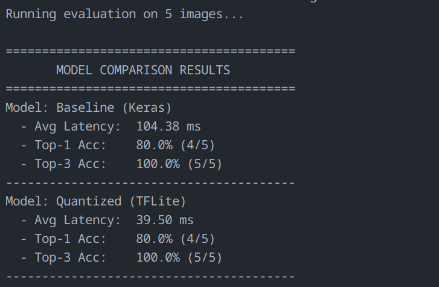

keras = 171.7mb, 104.38ms avg, 80% acc
tflite = 43.5mb, 39.50ms avg, 80% acc

I utilized some test images from the imagenet dataset, primarily because retraining the model to cifar would take an excessive amount of time for this assignment, and it has no accuracy without training. This has the downside that it will not be showing how accurate it is over an entire dataset, but I can show qualitatively that the model did not lose any accuracy from quantization. In the model tests I ran, the base (keras) model has a size of 171.7mb, and an average latency of 97ms, for an accuracy of 80% accuracy on my test image, as well as data. Next, I ran the quantized model which had a size of 43.5mb and a much lower average latency of 36.55 ms. This led to the same accuracy, also at 80%, which shows that the model did not lose accuracy over compression through quantization, nor through the increase in speed caused by quantization. The primary tradeoff, though, between a keras model and a tflite model is that you must manually loop through data in a tflite model as it runs step by step, whereas a keras model handles that for you.
Overall, I think that quantizing models is definitely useful for embedded uses, as there is generally storage constraints and as such having a much smaller model outweighs the need to manually iterate through the steps of prediction, as the code to manually iterate will be much smaller sizewise, not to mention the faster operation is extremely helpful.

Below, is an image displaying my results.

